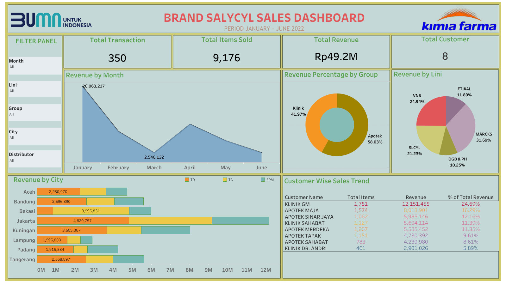

# Virtual Internship Experience - Big Data Analytics Kimia Farma

Tool : PostgreSQL  
Visualization Tool: Tableau - [Lihat Dahboard](https://public.tableau.com/app/profile/sonia.epifany.sandah/viz/trial_16945811128870/Dashboard2)  

---

## Introduction
Virtual Internship Experience Kimia Farma merupakan Internship secara virtual yang diadakan oleh Rakamin Academy dan bekerja sama dengan Kimia Farma. Pada project ini, sebagai Data Analyst intern yang diminta untuk membuat Dashboard dari data penjualan Brand Salicyl dari data mentah yang telah disediakan.

## Objective
- Membuat design datamart (tabel base dan tabel agregate)
- Membuat dashboard penjualan 

## Dataset  
Dataset yang disediakan terdiri dari tabel-tabel berikut : 

- Penjualan
- Barang
- Pelanggan

---

## Design Datamart
### Tabel Base
Tabel base dalam project ini dibuat dari gabungan tabel penjualan, barang, dan pelanggan dengan primary key `id_invoice`.  
[Klik disini untuk melihat Query](VIX-Big-Data-Analytics-Kimia-Farma/datamart/Tabel%20Base/table%20base.sql)

     
  Gambar 1 — Output Pembuatan Tabel Base

### Tabel Agregate
Dalam project ini terdapat beberapa tabel agregate yang dibuat dari tabel base.  
[Klik disini untuk melihat Query](VIX-Big-Data-Analytics-Kimia-Farma/datamart/Tabel%20Agregate/)

---
## Data Visualization

     
  Gambar 2 — Brand Salycyl Sales Dashboard

